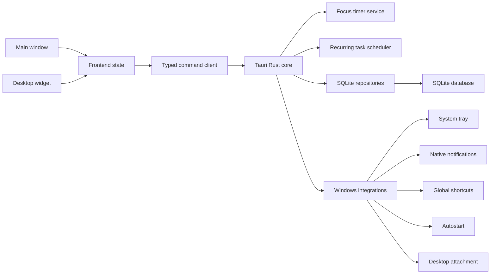
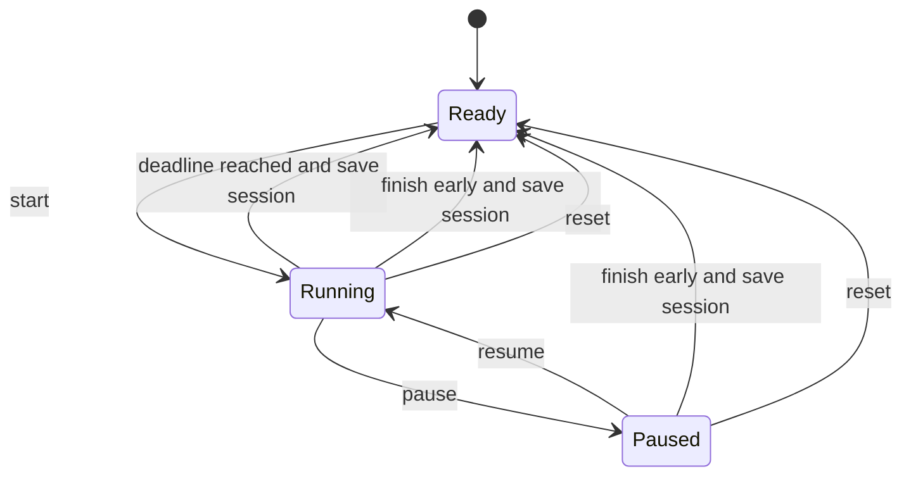

# 架构设计

## 系统概述

抵达 Focus 采用本地优先的 Tauri 双层架构。React 前端运行主窗口与桌面小组件窗口，负责界面、交互状态和视图组合；Rust 原生层负责应用生命周期、项目与重复任务领域服务、可靠计时、Windows 集成和受控数据访问。SQLite 是业务数据的唯一持久化来源。

## 当前实现状态

- Vite 提供 `index.html` 与 `widget.html` 双入口，分别挂载主窗口和小组件。
- React 主窗口已实现 232px 导航、动态周日期条、响应式三列今日工作台和四套主题切换。
- `src/theme/theme.ts` 以纯函数解析四套主题的明暗语义令牌，主窗口与小组件共享结果。
- `src/components/` 已提供图标及 Button、Panel、Dialog、Toast、SegmentedControl、Select、DateTimePicker、Progress、Badge 基础组件。
- Rust 已建立 domain、repository、service、command 模块边界，并注册 `health` command。
- SQLite 已实现连接配置、事务写入、顺序迁移、迁移失败写保护，以及项目和任务仓储 CRUD。
- 项目域已实现输入校验、状态机、历史移除策略、聚合摘要、截止风险、项目命令和 P5 属性测试。
- 项目页面已实现状态筛选、项目导航、创建编辑表单、归档操作及概览、任务、活动、统计标签。
- 任务域已实现标题、分类、优先级、日期时间与项目引用校验，以及创建、编辑、完成、恢复和软移除命令。
- 检查项与任务通过单事务保存，支持完成状态切换和稳定排序。
- 任务列表查询支持日期范围、项目、分类、完成状态和标题搜索，并返回所属项目摘要和稳定排序结果。
- 前端任务模块已定义与 Rust DTO 对齐的 TypeScript 类型和命令客户端，并实现任务编辑器、检查项编辑及五态 `TaskRow`。任务编辑器可选附加结构化重复规则。
- 今日页已实现按分类与完成状态组织的任务分区、定时日程、周目标和便签区域。Tauri 桌面运行时通过 `today_get_digest` 查询选中日期，并按 `sourceKind` 将普通任务和重复实例分发至各自命令；普通浏览器预览使用内存样例数据。
- 任务领域测试覆盖本地日期边界与格式、筛选参数、完成和恢复、软移除后的状态保护、项目关联与解除，以及稳定筛选结果；组件测试覆盖表单提交语义和任务操作的键盘焦点顺序。
- 重复计划域已实现规则模型、日期展开、规则与实例仓储、`RecurrenceScheduler` 和 `RecurrenceService`。调度器支持启动、日界线、规则变化和时区变化触发；实例服务支持完成、跳过、同日延后、顺延明日、规则暂停与结束，以及仅本次和未来计划变更。
- P1 属性测试随机覆盖四类有效重复规则、间隔、星期集合、月末日期、时区、可选本地时间、日期范围和重复调度次数，验证每个规则与计划日期组合始终只有一个实例。
- P2 属性测试使用 256 组随机场景覆盖四类有效重复规则、开放或有限有效期、五个代表性 IANA 时区、可选本地时间和跨边界查询范围，验证日期展开结果可重复、严格升序且位于规则与查询范围交集内。
- P3 属性测试使用 64 组临时数据库场景，在随机规则模式、执行时间和 IANA 时区变更下比较完整实例记录，验证已完成、已跳过和已有专注记录的实例保持状态、规则版本、计划时间和任务快照稳定。
- P4 属性测试使用 64 组临时数据库场景随机组合来源类型、相对日期和处理状态，并在每组中覆盖今日普通任务、今日项目任务、今日重复实例与逾期任务，验证 TodayDigest 的来源集合完备且无重复。
- 今日汇总域已实现 `TodayRepository` 和 `TodayService`，统一聚合普通任务、项目任务、重复实例和逾期事项，并输出去重后的确定顺序。React 已接入聚合 DTO，展示时间、项目、重复和逾期身份。
- 日历域已实现 `CalendarRepository` 和 `CalendarService`。服务按锚点生成周一至周日、自然月或自然年范围，以查询 IANA 时区计算 UTC 半开区间和本地日期归属，聚合普通任务、重复实例、完成记录与有效专注轮次，并保留周期内全部零数据日期。`StatisticsService` 复用该周期结果计算计划完成率、完成任务数、专注时长、有效轮次、活跃天数、完整日趋势和项目投入。React `CalendarWorkspace` 提供三种周期画布、筛选、日期详情和响应式统计复盘，浏览器预览复用同一 DTO 与前端纯聚合模型。
- Planning 域已实现 `PlanningRepository` 与 `PlanningService`。便签按本地日期读取并稳定更新该日期最近记录；周目标保存完成任务、专注分钟或活跃天数指标分类，并复用 `CalendarService` 与 `StatisticsSummary` 的自然周、IANA 时区和有效专注口径计算封顶进度。React 今日页在输入静默 500ms 后保存便签，支持 `Ctrl+Enter` 立即保存；任务写入和 `focus://completed` 事件触发 250ms 周目标刷新。
- Rust 专注域已实现 1–180 分钟时长校验、任务与重复实例目标校验、单活动轮次、开始、暂停、继续、重置、提前完成、到时完成和系统恢复校准。前端专注空间已接入权威状态、任务选择、计时控制、最近轮次和空格快捷键；系统托盘已接入权威状态读取、计时控制与后台到期校准，专注完成和定时任务到时通知已接入 Windows 原生通知，任务栏按每秒权威状态显示剩余比例和暂停状态。
- P6 属性测试使用 128 组随机场景覆盖 1–180 分钟计划时长和 0–24 小时非负毫秒跳变，通过完整 SQLite 服务路径验证剩余时间公式、持久化目标时间、到期完成状态和小于 2 秒的校准误差。
- P7 属性测试使用 64 组临时 SQLite 场景随机覆盖专注完成、普通任务到时和重复实例到时事件，以及不同来源标识、计划时间、重复处理次数、提示音偏好和发布失败结果，验证同一通知身份始终只产生一条投递记录且成功发布最多一次。
- 小组件配置域已实现紧凑、标准、展开三档尺寸与 1、5、10 条任务容量，保存显示模块、透明度、位置、实际尺寸、显示器、DPI、模式、锁定状态和最近可见时间。Tauri 启动时恢复隐藏小组件窗口，配置更新通过 `widget://config-changed` 同步独立 React 入口。
- Windows Shell 适配器已实现 Progman/WorkerW 宿主发现、窗口附着、2 秒句柄有效性监视和 Explorer 重启后的重新附着。发现或附着失败时解除父窗口关系并广播一次 `widget://mode-fallback`，用户配置仍保留桌面模式偏好。
- 小组件浮窗应用原生置顶策略，桌面贴附模式取消置顶。锁定状态启用鼠标穿透并固定窗口尺寸，解锁状态开放顶部拖动区和原生边缘缩放；系统托盘提供穿透状态下的解锁入口。移动、缩放及 DPI 变化经 180ms 防抖后写回 SQLite。
- 小组件 React 入口已实现三档内容密度：紧凑档显示时钟及当前专注或下一项待办，标准档显示最多 5 项，展开档显示最多 10 项。标准与展开档按模块配置组合当前专注、今日完成进度和任务列表，并提供普通任务完成、重复实例完成与今日延后、默认 25 分钟开始专注及活动轮次暂停和继续操作。
- 窗口恢复会读取主显示器与全部可用显示器工作区，以窗口左上 160 × 48 物理像素作为主要操作区域。保存位置仍可操作时保持原坐标；移出当前显示器集合时按窗口尺寸居中或对齐到主显示器安全区域。P8 属性测试验证任意有效窗口矩形和非空显示器集合下的恢复结果可操作。
- Windows 适配器集成测试通过 `ShellHostAdapter` 替身串联附着状态机、浮窗行为和 SQLite 小组件服务，覆盖首次附着、Explorer 替换宿主、连续故障提示去重、恢复后新故障重新提示，以及浮窗回退后的持久化解锁。
- `desktop::tray` 将专注状态映射为可测试菜单模型。托盘展示当前或下一任务、剩余时间，提供主窗口、小组件、开始/暂停/继续、快速任务、解锁和退出操作；左键释放恢复并聚焦主窗口。主窗口关闭事件默认隐藏窗口并保留进程，托盘刷新线程每秒调用 `FocusService::reconcile`，首次到期时落库并广播 `focus://completed`。
- `NotificationService` 统一编排专注完成与任务到时通知。`desktop::notifications` 通过 Tauri notification 插件提交 Windows Toast，按设置决定是否使用系统默认提示音；任务 worker 每 15 秒扫描一次，并以进程内上次扫描时间覆盖休眠和调度停顿。Windows 通知权限由系统设置管理，设置页展示系统管理状态并提供 `ms-settings:notifications` 入口。
- `desktop::shortcuts` 通过 Tauri global-shortcut 插件注册显示主窗口、切换专注、创建快速任务和解锁小组件。候选绑定先完成语法与重复校验，再注册新增按键并释放旧按键；系统冲突或持久化失败时恢复原运行态。`desktop_integration` 命令通过 autostart 插件同步 Windows 登录启动项，数据库写入失败时恢复系统原状态。
- 通用设置域定义语言、外观、主题和后台运行偏好，复用 `preferences` 表的 `generalPreferences` JSON 记录。`SettingsService` 以 Patch 语义保留未指定字段，`settings_update` 持久化后广播完整 `settings://changed` 载荷；主窗口和小组件共享系统明暗解析与主题令牌。通知、桌面集成和小组件配置继续使用各自专用命令，写入成功后同样触发设置广播。主窗口关闭策略在每次关闭请求时读取后台运行偏好。

## 架构图



## 技术栈

- Tauri 2：窗口、托盘、事件和 Windows 安装包。
- React + TypeScript + Vite：渲染层和交互界面。
- Rust：命令边界、计时服务、生命周期和系统集成。
- SQLite：任务、专注轮次、设置、便签和迁移记录。
- Tauri 官方插件：notification、global-shortcut、autostart、dialog、fs、sql、updater。

## 当前项目结构

```text
arrive-focus/
├── src/
│   ├── app/
│   ├── components/
│   ├── lib/
│   ├── styles/
│   ├── theme/
│   └── test/
├── src-tauri/
│   ├── capabilities/
│   ├── migrations/
│   ├── src/
│   │   ├── commands/
│   │   ├── domain/
│   │   ├── repositories/
│   │   └── services/
│   ├── Cargo.toml
│   └── tauri.conf.json
└── .monkeycode/docs/
```

`features/projects/`、`features/tasks/`、`features/today/`、`features/focus/` 与 `features/calendar/` 分别承载项目、任务、今日工作台、专注空间和日历复盘界面；`e2e/` 将在桌面自动化任务开始时创建。

## 目标核心模块

### 任务域

维护任务、检查项、任务实例、分类、日期约束、完成记录和搜索筛选。当前任务写入规则在 Rust 层执行，计划日期不能早于命令提供的本地日期，计划时间要求同时提供计划日期。任务移除保留 `removed` 历史状态；检查项与任务写入共享事务。列表查询通过固定 SQL 条件与参数绑定组合筛选，默认排除软移除任务，并按计划日期、计划时间、优先级、创建时间和标识稳定排序。前端 `TaskEditor` 在提交前执行等价的即时校验，支持项目、分类、优先级、日期时间和检查项增删排序；`TaskRow` 通过文字、颜色和独立操作区表达普通、当前、完成、逾期与暂停状态。

### 项目域

维护项目生命周期、项目任务关系、自动进度、截止风险和累计专注投入。当前状态机允许活动、暂停和完成项目在有效状态间转换，归档状态为终态。含任务、实例或专注历史的项目要求选择归档或解除历史关联，避免直接丢失上下文。

### 重复计划域

结构化规则支持每天、工作日、每周指定星期和每月指定日期。每天、每周和每月模式通过正整数 `interval` 表达自定义间隔；每周模式使用 ISO 星期值 1–7 且禁止重复；每月日期允许 1–31，超出目标月份长度时归一化为该月最后一个自然日。规则校验还覆盖 `HH:MM` 本地时间、IANA 时区、`YYYY-MM-DD` 起止日期、非空任务模板标识和正版本号，失败统一返回 `RECURRENCE_INVALID` 及字段位置。

`scheduled_dates` 以规则开始日期为间隔锚点，在调用方提供的日期范围内输出升序本地计划日期，并受规则起止日期和活动状态约束。`RecurrenceScheduler` 在启动或日界线触发时读取全部活动规则，通过 `(recurrence_rule_id, scheduled_date)` 唯一约束和 `ON CONFLICT DO NOTHING` 补齐缺失实例；规则或时区变化时使用 `ON CONFLICT DO UPDATE ... WHERE status = 'pending'` 刷新待处理实例的规则版本、UTC 时间和任务快照，已完成等历史实例保持稳定。

实例保存任务标题与项目关联快照、规则版本、本地计划日期和可选 UTC `scheduled_at`。夏令时导致的不存在本地时间向后查找第一个有效分钟，歧义本地时间稳定选择较早时刻。

实例状态使用 `pending`、`completed`、`skipped` 和 `rescheduled`。完成与跳过支持同状态重复调用；其他已处理实例返回 `INSTANCE_NOT_ACTIONABLE`。今日延后只修改原实例的 UTC 计划时间并要求目标时间晚于当前时间。顺延明日在单事务内将原实例改为 `rescheduled` 并创建目标 `pending` 实例；目标日期已有可操作实例时复用该实例，从而继续满足规则日期唯一性。

实例写操作通过 SQL 条件同时排除 `active_focus` 和已有 `focus_sessions` 关联记录，避免覆盖已开始实例。暂停和结束规则只递增规则版本并更新状态，保留全部已生成实例；`ended` 是终态。范围变更使用 `RecurrenceChangeScope`：`thisInstance` 只更新指定 pending 实例的计划时间，`future` 要求规则版本递增一并原子更新规则和范围内 pending、未开始实例。

### 今日汇总域

`TodayRepository` 通过单次候选查询聚合普通任务、项目任务和重复实例。普通任务通过项目关联区分 `ordinaryTask` 与 `projectTask`；与重复规则关联的任务模板从普通任务来源排除，由对应实例表达可执行事项。今日 pending/completed 记录和日期更早的 pending 记录进入候选集，skipped、rescheduled、removed 与未来记录退出汇总。

`TodayService` 使用 `(source_kind, source_id)` 去重，并派生 `is_overdue`。实例 UTC `scheduled_at` 按规则 IANA 时区转换为本地 `HH:MM`，与普通任务本地计划时间进入同一排序键。排序依次采用逾期优先、有计划时间优先、计划时间升序、优先级降序、创建时间、来源类型和来源标识，保证重复查询输出一致。

前端 `todayModel` 将 `TodayDigestItem` 装饰为保留 `sourceKind`、`sourceId`、规则标识和视觉状态的 `WorkspaceTask`。普通任务继续调用任务命令；重复实例调用完成、跳过、今日延后和顺延明日命令。点击重复实例会读取规则并打开范围对话框，分别表达 `thisInstance` 和 `future` 变更。

### 专注域

`domain::focus` 定义 `ready`、`running`、`paused` 状态和合法转换。运行状态保存 UTC 目标结束时间，暂停时把校准后的剩余秒数固化并清除目标时间；每次暂停将中断次数加一，继续时以当前 UTC 时间和暂停剩余秒数重建目标时间。时长接受 1–180 分钟，目标要求在普通任务与重复实例之间精确选择一个，并且来源仍处于可执行状态。

`FocusRepository` 使用 `active_focus` 的固定主键维护全局唯一活动轮次。`FocusService` 在完成或重置时先计算实际专注秒数，再通过单事务写入 `focus_sessions` 并清除 `active_focus`。提前完成和到时完成分别保存 `early` 与 `deadline` 有效记录；重置保存 `cancelled` 记录。到时完成要求剩余时间已归零，防止调用方提前伪造自然结束。

`FocusService::reconcile` 以当前 UTC 时间重新读取权威状态。运行轮次通过持久化目标时间计算剩余秒数，系统时间回拨时将剩余值限制在计划时长内，暂停轮次保持已保存剩余值。仓储的 `complete_due` 在单个数据库事务中读取、判断并完成到期轮次；重复或并发校准只有一个调用获得完成记录，其余调用返回当前 `ready` 状态。Tauri `RunEvent::Resumed` 和 `focus_reconcile` 命令共享该流程，首次完成后发送通知并广播 `focus://completed`。

前端 `focusModel` 将普通任务和重复实例分别映射为互斥的 `taskId` 与 `taskInstanceId`，并从 `targetEndsAt` 计算运行态显示值。`FocusWorkspace` 提供 15、25、50 分钟预设、1–180 分钟自定义时长、开始、暂停、继续、重置和提前完成确认；浏览器预览使用内存状态，Tauri 运行时通过 `focusClient` 调用七个命令并监听 `focus://completed`。空格键只在焦点位于普通页面区域且完成确认框关闭时控制主状态转换。

### 日历与统计域

`CalendarRepository` 分别查询项目、普通任务、重复实例和专注轮次。普通任务查询排除重复模板；实例保留模板分类和项目快照；专注查询排除 `cancelled` 记录。计划记录按 `scheduled_date` 归入日期，完成记录与专注轮次先通过周期对应的 UTC 半开区间缩小候选，再按查询 IANA 时区转换 `completed_at` 或 `ended_at` 得到本地日期。

`CalendarService` 从 `period` 与 `anchorDate` 生成完整自然周期，预先创建每个 `CalendarDay`，再将候选记录聚合到 `plannedTasks`、`completedTasks` 和 `focusSessions`。分类与项目筛选统一作用于三类来源，返回项目列表供前端构建筛选器。

`StatisticsService` 调用 `CalendarService::get_period`，再由 `StatisticsSummary::from_calendar` 执行纯聚合。计划完成率以周期内状态为 `completed` 的计划条目除以全部计划条目；完成任务数按周期内完成事件计数；活跃日要求存在完成任务或有效专注；总专注包含无项目轮次，项目投入仅列出具有关联项目的有效轮次，并按实际秒数降序排列。趋势保留周期内完整日序列，前端仅在年度视图把日数据汇总为月数据。

### 便签与周目标域

`DailyNoteInput` 校验 `YYYY-MM-DD` 日期和最多 4000 个 Unicode 字符。`PlanningRepository` 读取同日记录时按 `updated_at` 与 `id` 倒序选择最近一条，保存时更新该记录并兼容旧数据库中可能存在的同日多条数据。

`WeeklyGoalInput` 要求周起始日期为周一、标题长度为 1–200、目标数量为正整数。指标分类使用 `completedTasks`、`focusMinutes` 与 `activeDays` 命令值，对应数据库中的 `completed_tasks`、`focus_minutes` 与 `active_days`。`PlanningService` 以周起始日期构造无分类和项目筛选的 `CalendarQuery`，复用统计摘要选择对应指标，并将进度限制在目标数量以内后回写数据库。

### 桌面集成

`domain::widget` 定义 `WidgetSize`、`WidgetMode`、八类 `WidgetModule` 与 `WidgetConfig`，并校验透明度范围、有限坐标、正尺寸、正 DPI 及显示模块非空且无重复。三档默认逻辑尺寸分别为 320 × 132、360 × 420 和 440 × 640。

`WidgetRepository` 在一个写事务内 upsert `widget_layout` 与 `window_state`，布局表保存模式、锁定、透明度、模块和最近可见时间，窗口表保存物理位置、逻辑尺寸、显示器和缩放比例。`WidgetService` 首次读取时创建默认标准档配置，普通更新保留最近可见时间，显示窗口时更新时间。Tauri 提供配置读取、更新和显示命令；应用启动阶段恢复隐藏窗口的尺寸和位置，更新后向小组件窗口广播 `widget://config-changed`。

`WidgetService::unlock` 负责清除并持久化锁定状态，Tauri command 在服务写入成功后应用鼠标交互、缩放、显示与聚焦行为。该边界使解锁状态转换可以与 Shell 回退结果在无图形宿主的集成测试中组合验证。

`desktop::shell_attachment` 定义与 Win32 解耦的宿主适配器端口和附着状态机。状态机记录请求模式、当前宿主和回退提示状态：有效宿主保持附着，失效宿主重新发现并附着，连续失败只请求一次状态提示。`desktop::windows_shell` 将 WorkerW 枚举、`IsWindow` 和 `SetParent` 等 `unsafe` Win32 调用集中封装；`desktop::widget_shell` 获取 Tauri HWND、每 2 秒执行恢复检查，并将运行结果映射为桌面或普通浮窗。

`desktop::widget_window` 将实际运行模式和锁定状态映射为置顶、鼠标穿透与可缩放策略，并把物理位置、物理尺寸和缩放比例转换为持久化所需的物理坐标与逻辑尺寸。独立几何监视线程对窗口事件防抖，避免拖动和缩放期间频繁写库。小组件顶部使用 Tauri drag region；锁定后通过托盘或全局快捷键恢复交互。`desktop::tray` 负责菜单状态、主窗口关闭策略、窗口恢复、任务栏进度和托盘动作编排；`desktop::notifications` 负责原生通知发布、到时扫描和 Windows 设置入口；`desktop::shortcuts` 负责全局注册、动作映射和冲突回滚；`commands::desktop_integration` 负责快捷键偏好与开机启动同步。Tauri capability 文件按窗口标签和最小权限列出前端可调用操作。

同一模块的 `restore_visible_rect` 是与 Tauri 解耦的窗口恢复核心。它先验证主要操作矩形是否完整落入任一工作区，再以工作区列表首项作为主显示器回退目标；超出工作区的超大窗口从工作区原点对齐，保证左上操作区可见。`restored_widget_position` 把逻辑尺寸按保存的 DPI 转为物理矩形，并在原生 `set_position` 前应用恢复结果。

前端 `widgetModel` 将 `TodayDigest` 转换为三档稳定任务切片，计算完成数与总数，并把普通任务和重复实例映射为互斥的 `FocusTarget`。`WidgetApp` 每秒依据权威 `targetEndsAt` 刷新本地倒计时，每 2 秒重新读取 Rust 专注状态；任务写操作完成后重新获取当日汇总。浏览器入口使用内存样例数据支持独立预览，Tauri 入口从空汇总开始加载本地权威数据。

### 数据管理

仓储层负责事务和查询；迁移层维护 schema 版本；备份服务负责 JSON 序列化、导入校验、恢复前快照和事务替换。

### 设置域

`domain::settings` 使用 camelCase 枚举值定义 `system | zhCn | en` 语言、`system | light | dark` 外观和四套主题。`GeneralPreferencesPatch` 的可选字段由领域模型合并，`SettingsService` 负责读取与写入；前端 `SettingsWorkspace` 组合通用、通知、桌面集成、小组件和数据设置面板。浏览器预览在内存中应用通用偏好，Tauri 运行时通过命令持久化并监听统一事件。语言资源切换与备份命令分别由后续国际化和数据管理任务实现。

## 关键流程

### 专注轮次状态



### 后台计时恢复

1. 开始轮次时保存 `started_at`、`target_ends_at` 和计划时长。
2. 主窗口隐藏后，SQLite 中的目标结束时间继续作为权威计时依据。
3. 托盘刷新线程每秒调用 `FocusService::reconcile`；系统恢复时同一服务也通过 Tauri `RunEvent::Resumed` 触发。
4. 到期轮次通过 `complete_due` 原子写入完成记录并广播一次 `focus://completed`。
5. 未到期轮次返回按当前时间校准后的剩余秒数，暂停轮次保持暂停值，托盘同步更新标签。

### 备份恢复

1. 原生文件对话框选择 JSON 文件。
2. 解析器校验版本、类型、范围和引用关系。
3. 应用显示数据摘要和替换范围。
4. 用户确认后创建恢复前快照。
5. 单事务替换业务表并写入导入记录。
6. 前端重新加载权威数据。

## 数据模型

首个迁移已创建 `projects`、`tasks`、`task_check_items`、`recurrence_rules`、`task_instances`、`focus_sessions`、`active_focus`、`notes`、`weekly_goals`、`preferences`、`window_state`、`widget_layout`、`backup_history` 和 `schema_migrations`。第二个迁移创建 `notification_deliveries`，以通知类型、来源标识和计划时间唯一约束保存 `pending | sent | failed` 投递状态。第三个迁移为 `weekly_goals` 增加指标分类及周与分类组合索引，旧记录默认归类为完成任务。时间字段使用 UTC ISO 8601 文本，重复规则同时保存 IANA 时区标识和本地计划日期。

数据库位于 Tauri 应用数据目录的 `arrive-focus.sqlite3`。连接启用外键、5 秒 busy timeout 与 WAL；所有写操作通过事务执行。迁移批次发生错误时整体回滚，启动对象进入只读保护状态并拒绝后续写入。

## 设计决策

- 权威计时状态位于 Rust 层和 SQLite，保证窗口隐藏与页面重载后的连续性。
- 前端通过窄化的 Tauri commands 访问业务能力，避免直接暴露任意文件系统和数据库操作。
- 首版使用主窗口与桌面小组件双窗口，共享 Rust 事件总线和数据库权威状态。
- 小组件布局与窗口几何信息分表保存，并在同一事务中更新，避免跨表配置版本不一致。
- 桌面贴附通过隔离的 Windows 原生适配器实现，适配失败时使用普通浮窗保证组件可见。
- 桌面贴附回退表示当前运行模式，持久化配置继续表达用户请求模式，宿主恢复后可自动重新附着。
- NSIS 作为默认安装包；公开发布前加入 Windows 代码签名和更新包签名。
- 数据格式与数据库 schema 分别维护版本号，支持独立演进。

## 可靠性约束

- 每个运行中的专注轮次拥有唯一 `active_focus` 记录。
- 完成或重置专注轮次时，历史记录写入和活动状态清除位于同一事务。
- 重复或并发处理同一到期轮次最多生成一条 `deadline` 会话记录。
- 一个任务的完成时间只在完成状态下存在。
- 备份恢复通过单事务完成，并在事务前生成自动快照。
- 专注完成和任务到时通知按类型、来源标识与计划时间去重。
- 快捷键候选发生系统冲突时保持原持久化配置和原运行态绑定。
- 开机启动系统状态更新与偏好写入任一步骤失败时恢复变更前状态。
- 通知 worker 的连续扫描窗口覆盖进程休眠与调度停顿，系统时间回拨时回退到最近 5 分钟安全窗口。
- 窗口恢复位置经过当前显示器工作区校验。
- 同一重复规则在同一计划日期最多拥有一个任务实例。
- 启动和日界线重复执行只补齐缺失实例；规则和时区变化只覆盖待处理实例的可刷新字段。
- 重复实例保留生成时的任务标题、项目关联和规则版本快照。
- 已完成、已跳过、已顺延和已开始实例不会被实例操作或未来规则刷新覆盖。
- 今日汇总中每个来源对象最多出现一次，完全相同业务排序键通过来源类型和来源标识保持确定顺序。
- 项目进度只统计项目活动任务，归档任务保留在历史统计中。
- 便签正文最多包含 4000 个 Unicode 字符，同一日期保存时稳定更新最近记录。
- 周目标进度复用自然周统计定义，并限制在零至目标数量范围内。
- 通用设置更新只覆盖 Patch 指定字段，未指定偏好保持原值。
- `settings://changed` 载荷始终为当前完整通用偏好，主窗口与小组件解析同一主题和明暗模式。
- 主窗口与桌面小组件对同一业务对象展示一致版本。
