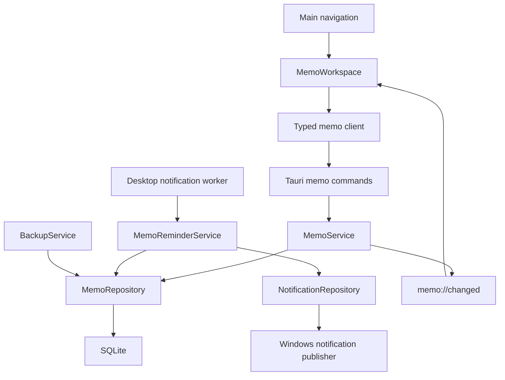

# 抵达 Focus 备忘录中心技术设计

Feature Name: `arrive-focus-memo-center`
Updated: 2026-07-23
Status: Draft for review

## Description

备忘录中心在抵达 Focus 主窗口中增加独立导航与页面，提供多条纯文本备忘录的创建、编辑、删除、搜索、标签、置顶、一次性提醒和重复提醒。业务数据继续由 Rust 领域服务和 SQLite 管理，React 只保存搜索条件、编辑草稿和保存状态等临时 UI 状态。

今日页随手便签继续按日期保存到现有 `notes` 表。备忘录中心使用独立领域模型、数据表和 command，避免长期备忘录与每日便签共享生命周期。通知投递复用现有租约、失败重试和幂等记录边界。

## Architecture



### Runtime Flow

1. 主窗口打开备忘录页面后通过 `memo_list` 读取 SQLite 权威列表。
2. 编辑器维护当前草稿，停止输入 500 毫秒或按下 Ctrl+Enter 后调用 `memo_create` 或 `memo_update`。
3. Rust 服务完成事务后发送 `memo://changed`，主窗口重新读取列表和当前详情。
4. 桌面通知 worker 在现有协调周期中查询到期备忘录提醒，使用通知投递表预留发生时间。
5. 通知成功后服务推进重复提醒的下一发生时间；进程在两步之间中断时，下一轮依据已发送投递记录完成推进。
6. 通知点击携带备忘录稳定标识，主窗口显示并定位对应编辑器。

## Components and Interfaces

### Frontend Navigation

`src/app/App.tsx` 的 `pages` 增加 `memos` 页面，顺序位于“今日”和“项目”之间。`src/components/Icon.tsx` 增加备忘录图标，`src/i18n/messages.ts` 增加中英文导航、表单、筛选、通知和错误文案。

主页面组件位于 `src/features/memos/`：

- `MemoWorkspace.tsx`：搜索、标签筛选、列表、空状态和编辑区域。
- `MemoEditor.tsx`：标题、纯文本正文、标签、置顶、保存状态和删除确认。
- `MemoReminderEditor.tsx`：一次性与重复提醒规则编辑。
- `memoClient.ts`：封装备忘录 Tauri commands。
- `types.ts`：前端 DTO 与判别联合。

桌面宽度充足时使用“列表 + 编辑器”双栏布局；窄窗口使用单栏详情切换。列表和编辑器各自允许内容滚动，页面整体继续遵守现有 125% 文本缩放和减少动态效果规则。

### UI and Frontend Design Plan

备忘录页面沿用 232px 主侧栏和 32px 页面内边距。页面内容宽度大于等于 980px 时采用 360px 列表栏与弹性编辑栏；页面内容宽度小于 980px 时采用单栏列表，打开记录后切换到全宽编辑器并提供明确返回操作。

```text
┌──────────────────────────────────────────────────────────────────────┐
│ 备忘录                                    [搜索框] [新建备忘录]      │
├──────────────────────────┬───────────────────────────────────────────┤
│ 全部  工作  灵感  待办    │ [置顶] 标题                   [提醒] [...] │
│                          │ 标签输入                                  │
│ ■ 置顶记录               │ ┌───────────────────────────────────────┐ │
│   标题 / 摘要 / 标签      │ │ 纯文本正文                            │ │
│   提醒时间 / 更新时间     │ │                                       │ │
│                          │ └───────────────────────────────────────┘ │
│ □ 普通记录               │ 保存状态    [设置提醒] [删除] [保存]     │
│   标题 / 摘要 / 标签      │                                           │
└──────────────────────────┴───────────────────────────────────────────┘
```

列表栏包含搜索框、可横向滚动的标签筛选条、记录数量和备忘录列表。置顶记录使用强调色图标与“置顶”文字双重标识；提醒状态显示“今天 10:00”“每周一 09:00”或“已提醒”等明确摘要。列表项正文摘要最多两行，标签最多展示三个，其余使用数量提示。

编辑栏顶部包含标题、置顶切换和更多操作；正文使用可增长的纯文本输入区；底部操作栏固定显示保存状态、提醒入口、删除和显式保存。提醒编辑器使用 Dialog，按“一次提醒 / 重复提醒”分段切换，并根据频率渐进展示日期、星期、月份日期、间隔、时间、时区和结束日期字段。

页面状态遵循以下展示规则：

| State | List | Editor | Primary action |
|-------|------|--------|----------------|
| 首次空状态 | 用途说明和插图占位 | 隐藏 | 创建第一条备忘录 |
| 加载中 | 保持列表骨架尺寸 | 保持编辑器骨架尺寸 | 禁用写操作 |
| 正常列表 | 展示置顶与普通记录 | 展示选中记录 | 新建备忘录 |
| 搜索无结果 | 展示条件和零结果说明 | 隐藏 | 清除筛选 |
| 新建草稿 | 选中临时草稿项 | 空标题与正文 | 保存备忘录 |
| 保存失败 | 保留当前列表位置 | 保留草稿并显示错误 | 重新保存 |
| 记录失效 | 刷新权威列表 | 关闭详情 | 选择其他记录 |

视觉实现复用 `.panel`、`Button`、`Dialog`、`Badge`、`SegmentedControl`、Toast 和主题令牌。新样式使用 `.memo-workspace`、`.memo-list-pane`、`.memo-list-item`、`.memo-editor`、`.memo-tags` 和 `.memo-actions` 命名空间。正文和背景保持 4.5:1 对比度，所有图标按钮提供文字名称和 tooltip，键盘顺序依次为搜索、标签、列表、新建、标题、置顶、正文、提醒、删除和保存。

### TypeScript Interfaces

```ts
type MemoReminderSchedule =
  | { kind: "once"; scheduledLocal: string; timezone: string }
  | {
      kind: "recurring";
      frequency: "daily" | "weekdays" | "weekly" | "monthly";
      interval: number;
      weekdays: number[];
      monthlyDay: number | null;
      localTime: string;
      startsOn: string;
      endsOn: string | null;
      timezone: string;
    };

interface MemoInput {
  title: string;
  body: string;
  tags: string[];
  pinned: boolean;
  reminder: MemoReminderSchedule | null;
}

interface MemoRecord {
  id: string;
  title: string;
  body: string;
  displayTitle: string;
  tags: MemoTag[];
  pinnedAt: string | null;
  reminder: MemoReminder | null;
  createdAt: string;
  updatedAt: string;
}

interface MemoListQuery {
  search: string;
  tagId: string | null;
}
```

`memoClient` 公开以下命令：

| Command | Input | Output | Purpose |
|---------|-------|--------|---------|
| `memo_list` | `MemoListQuery` | `MemoSummary[]` | 查询、筛选和排序列表 |
| `memo_get` | `{ id }` | `MemoRecord` | 读取完整详情 |
| `memo_create` | `MemoInput` | `MemoRecord` | 创建记录及关联数据 |
| `memo_update` | `{ id, input }` | `MemoRecord` | 更新记录及关联数据 |
| `memo_remove` | `{ id }` | `null` | 事务删除记录 |
| `memo_tag_list` | none | `MemoTag[]` | 读取可筛选标签 |

commands 继续返回现有 `CommandResult<T>`。所有成功写 command 在事务提交后发送一次 `memo://changed`。

### Rust Domain Services

`MemoService` 负责字段规范化、长度限制、标签去重、置顶时间、显示标题、事务写入和删除。显示标题优先使用非空标题；标题为空时使用正文首个非空行的前 40 个 Unicode 字符；两者均为空时使用本地化的“无标题备忘录”。

`MemoReminderService` 负责验证提醒规则、计算 UTC 发生时间、扫描到期提醒、预留投递、调用 publisher、标记投递结果和推进下一发生时间。日期计算共享现有任务重复计划的纯领域日期工具，数据表和 command 保持独立。

提醒扫描使用 UTC 当前时间作为输入，并按规则保存的 IANA 时区计算本地日期。每月指定日期超出目标月份天数时落在该月最后一个自然日。自定义间隔通过 `interval` 与频率组合表达，例如每 2 天或每 3 周。

### Desktop Integration

现有 `desktop::notifications` worker 增加备忘录提醒候选来源。通知 `kind` 增加 `memoReminder`，`source_id` 使用提醒 ID，`scheduled_for` 使用具体 UTC 发生时间，因此每次重复发生都有独立幂等身份。

通知激活参数只包含备忘录 ID。桌面适配层验证 ID 格式后调用现有主窗口显示能力，并发送 `memo://open-requested`。React 接收事件后切换到备忘录页面并读取对应记录。激活参数不包含标题或正文。

## Data Models

### SQLite Migration

新增 `0004_memo_center.sql`：

```sql
CREATE TABLE memos (
    id TEXT PRIMARY KEY NOT NULL,
    title TEXT NOT NULL,
    body TEXT NOT NULL,
    pinned_at TEXT,
    created_at TEXT NOT NULL,
    updated_at TEXT NOT NULL
);

CREATE TABLE memo_tags (
    id TEXT PRIMARY KEY NOT NULL,
    name TEXT NOT NULL,
    normalized_name TEXT NOT NULL UNIQUE,
    created_at TEXT NOT NULL
);

CREATE TABLE memo_tag_links (
    memo_id TEXT NOT NULL REFERENCES memos(id) ON DELETE CASCADE,
    tag_id TEXT NOT NULL REFERENCES memo_tags(id) ON DELETE CASCADE,
    PRIMARY KEY (memo_id, tag_id)
);

CREATE TABLE memo_reminders (
    id TEXT PRIMARY KEY NOT NULL,
    memo_id TEXT NOT NULL UNIQUE REFERENCES memos(id) ON DELETE CASCADE,
    schedule_kind TEXT NOT NULL CHECK(schedule_kind IN ('once', 'recurring')),
    frequency TEXT CHECK(frequency IN ('daily', 'weekdays', 'weekly', 'monthly')),
    interval_value INTEGER,
    weekdays_json TEXT,
    monthly_day INTEGER,
    local_time TEXT NOT NULL,
    starts_on TEXT NOT NULL,
    ends_on TEXT,
    timezone TEXT NOT NULL,
    next_scheduled_for TEXT,
    status TEXT NOT NULL CHECK(status IN ('active', 'completed', 'cancelled')),
    created_at TEXT NOT NULL,
    updated_at TEXT NOT NULL
);
```

`notification_deliveries.kind` 当前由 CHECK constraint 限制为三个值，迁移将通过建新表、复制数据、替换表的 SQLite 兼容流程增加 `memoReminder`。复制过程保留既有投递记录和唯一约束。

索引包括：

- `memos(pinned_at, updated_at)` 支持稳定列表排序。
- `memo_tag_links(tag_id, memo_id)` 支持标签筛选。
- `memo_reminders(status, next_scheduled_for)` 支持到期扫描。
- `memo_tags(normalized_name)` 通过唯一约束保证规范化名称唯一。

搜索查询对用户输入中的 `%`、`_` 和转义符进行字面量转义，使用参数化 `LIKE` 匹配标题、正文和标签。查询组合搜索条件与标签条件，并统一应用置顶、更新时间和 ID 稳定排序。

### Reminder State

- `active`：提醒参与扫描，`next_scheduled_for` 保存下一次 UTC 时间。
- `completed`：一次性提醒成功投递，下一发生时间为空。
- `cancelled`：用户取消提醒，下一发生时间为空。

更新提醒规则会重新计算下一发生时间。已经发送的历史投递记录继续保留，用于诊断和幂等判断。删除备忘录会级联删除提醒定义；通知投递记录按现有数据保留策略保存稳定来源标识，不包含备忘录正文。

### Backup Format

备份格式升级为版本 2，新增 `memos`、`memoTags`、`memoTagLinks` 和 `memoReminders` 集合。导出始终生成版本 2；解析器继续接受已持久化的版本 1 备份，并把缺失的备忘录集合解释为空集合。版本 2 解析在写入前验证字段长度、枚举、时区、时间、唯一性和跨记录引用。

## Correctness Properties

### Property M1：最新草稿保持

对于任意交错的编辑值和保存完成顺序，编辑器最终展示值等于用户最后一次输入值。较早保存结果只更新对应保存版本，不覆盖后续草稿。

### Property M2：标签规范化唯一

对于任意仅大小写和首尾空白不同的标签名称，规范化后最多存在一个 `memo_tags` 记录，单条备忘录最多存在一个对应关联。

### Property M3：稳定排序

对于任意备忘录集合，列表先按是否置顶、置顶时间倒序、更新时间倒序和 ID 升序排序。相同数据集的重复查询产生相同顺序。

### Property M4：提醒发生幂等

对于任意提醒 ID 和 UTC 发生时间，重复协调最多产生一条状态为 `sent` 的通知投递记录，并最多调用一次成功的系统通知发布。

### Property M5：重复提醒单调推进

对于任意有效重复规则，成功投递后的 `next_scheduled_for` 严格晚于当前发生时间，并符合规则的本地日期、时间和时区。

### Property M6：事务删除

对于任意备忘录删除操作，事务成功后备忘录、标签关联和提醒定义全部缺失；事务失败后这三类记录全部保持原值。

### Property M7：备份往返

对于任意有效版本 2 备忘录数据集，执行导出、解析、恢复和再次导出后，规范化业务模型保持等价。

### Property M8：筛选交集

对于任意搜索词和标签，查询结果中的每条备忘录同时满足文本匹配和标签关联，所有同时满足条件的记录都出现在结果中。

## Error Handling

| Error code | Condition | UI behavior |
|------------|-----------|-------------|
| `MEMO_NOT_FOUND` | 备忘录 ID 缺失 | 关闭失效详情并刷新列表 |
| `MEMO_TITLE_TOO_LONG` | 标题超过 200 字符 | 聚焦标题并显示长度提示 |
| `MEMO_BODY_TOO_LONG` | 正文超过 20000 字符 | 聚焦正文并显示长度提示 |
| `MEMO_TAG_INVALID` | 标签为空或超过 30 字符 | 保留草稿并标记标签输入 |
| `MEMO_TAG_LIMIT_EXCEEDED` | 单条记录超过 10 个标签 | 保留现有标签并提示上限 |
| `MEMO_REMINDER_INVALID` | 提醒字段组合无效 | 聚焦提醒编辑器并说明字段 |
| `MEMO_REMINDER_IN_PAST` | 下一提醒时间早于当前时间 | 请求选择未来时间 |
| `MEMO_SAVE_FAILED` | SQLite 写入失败 | 保留草稿并提供重新保存 |
| `MEMO_DELETE_FAILED` | 删除事务失败 | 恢复权威记录并显示错误 |
| `MEMO_NOTIFICATION_FAILED` | 系统通知发布失败 | 保留可重试状态并记录脱敏日志 |

Rust 日志只记录 command、稳定错误码、字段名、提醒 ID 和时间。日志不记录标题、正文、标签名称、搜索词或通知正文。

## Test Strategy

### Frontend Component Tests

- 验证导航入口、空状态、列表排序、双栏与窄窗口切换。
- 使用 fake timers 验证 500 毫秒自动保存、Ctrl+Enter、保存竞态和失败重试。
- 验证搜索防抖、搜索与标签交集、零结果和条件恢复。
- 验证标签规范化提示、10 标签上限、置顶和删除确认。
- 验证一次性、每天、工作日、每周、每月和自定义间隔提醒表单。
- 验证键盘操作、可读名称、焦点恢复和双语文案完整性。

### Rust Unit and Property Tests

- `proptest` 覆盖 M2、M3、M5、M7 和 M8。
- 固定 UTC 时钟覆盖时区、夏令时、月末收敛、开始日期和结束日期。
- 故障注入覆盖删除事务、标签替换和提醒推进回滚。
- 内存 publisher 覆盖提醒预留、失败、lease 接管、成功和重复协调。

### Integration Tests

- 临时 SQLite 数据库执行 `0004_memo_center.sql` 并验证既有通知投递数据迁移保持。
- 串联 create、list、search、update、remind、delete 和 backup commands。
- 验证版本 1 备份导入为空备忘录集合，版本 2 备忘录数据完整往返。
- `desktop-app` feature 编译验证通知点击到 `memo://open-requested` 的接线。

### Quality Gates

- `pnpm test`
- `pnpm typecheck`
- `pnpm build`
- `cargo fmt --all -- --check`
- `cargo test --offline --locked`
- `cargo check --offline --locked --features desktop-app`
- `cargo clippy --offline --locked --all-targets --features desktop-app -- -D warnings`
- `git diff --check`

## References

[^1]: `.monkeycode/specs/arrive-focus-desktop/requirements.md` - 现有桌面应用需求、便签、通知、备份和重复规则边界。
[^2]: `.monkeycode/specs/arrive-focus-desktop/design.md` - Tauri、React、Rust、SQLite 和桌面通知架构。
[^3]: `arrive-focus/src/app/App.tsx` - 主窗口导航、页面状态和领域事件接线。
[^4]: `arrive-focus/src-tauri/src/services/notification_service.rs` - 通知协调、幂等预留和失败重试。
[^5]: `arrive-focus/src-tauri/src/repositories/notification_repository.rs` - 通知 lease 与唯一投递身份。
[^6]: `arrive-focus/src-tauri/src/services/backup_service.rs` - 版本化备份解析与恢复边界。
