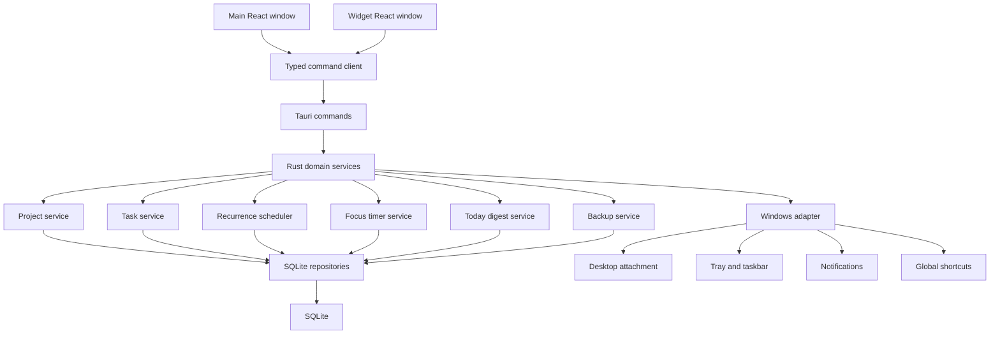

# 抵达 Focus Windows 桌面版技术设计

Feature Name: `arrive-focus-desktop`
Updated: 2026-07-18

## Description

抵达 Focus 是一款本地优先的 Windows 专注系统。系统通过长期项目承载持续工作，通过重复规则生成每天可执行的任务实例，通过今日汇总统一组织普通任务、项目任务、重复任务与逾期任务，并通过桌面小组件持续呈现当前行动。专注轮次、系统托盘、通知、快捷键和日历复盘形成完整桌面闭环。

首版目标平台为 Windows 10 22H2 x64 与 Windows 11 23H2 x64，采用 Tauri 2、React、TypeScript、Rust 与 SQLite。主窗口与桌面小组件共享 Rust 领域服务、SQLite 权威数据和 Tauri 事件总线。

## Architecture



### Process Model

Tauri 使用单进程承载 Rust 核心与两个 WebView 窗口。`main` 窗口提供完整工作台，`widget` 窗口提供紧凑桌面视图。两个窗口只维护临时 UI 状态，业务变更通过命令进入 Rust 服务。服务完成事务后递增数据版本并广播领域事件，窗口按版本刷新相关查询。

### Module Boundaries

| Module | Responsibility | Requirement references |
|--------|----------------|------------------------|
| App shell | 安装、单实例、窗口恢复和生命周期 | R1.1–R1.5, R10.3–R10.5 |
| Project | 项目生命周期、关系、进度和投入 | R12.1–R12.8 |
| Task | 任务、检查项、筛选与完成状态 | R2.1–R2.6 |
| Recurrence | 规则验证、实例生成、变更范围和补生成 | R13.1–R13.12 |
| Today digest | 今日聚合、稳定排序和逾期处理 | R13.7–R13.11 |
| Focus | 计时状态机、校准、轮次记录 | R3.1–R3.8 |
| Widget | 双模式窗口、布局、锁定和状态同步 | R11.1–R11.10 |
| Desktop integration | 托盘、通知、快捷键、开机启动和任务栏 | R4.1–R5.5 |
| Calendar and statistics | 日历查询、项目与专注聚合 | R6.1–R7.4, R12.4–R12.5 |
| Data management | SQLite、迁移、备份、恢复和快照 | R8.1–R8.7 |
| Design system | 主题、令牌、无障碍和信息层级 | R9.1–R9.6, R14.1–R14.6 |

## Components and Interfaces

### Frontend Application

前端按 `app`、`features`、`components`、`lib` 和 `styles` 分层。业务 feature 包含页面、查询适配器、表单 schema 和局部状态。共享组件只依赖设计令牌与领域 DTO。

主要路由：

- `/today`：今日汇总、周目标、日程与便签。
- `/projects`：项目列表与筛选。
- `/projects/:projectId`：项目概览、任务、活动和统计。
- `/focus`：当前任务、计时舞台与轮次记录。
- `/calendar`：周、月、年复盘。
- `/settings`：桌面行为、主题、快捷键和数据管理。
- `/widget`：桌面小组件专用入口，通过窗口标签限制能力。

### Command Client

TypeScript 客户端为每个 Tauri command 提供输入与输出类型，并统一转换领域错误。界面使用查询键缓存只读结果；命令成功后依据返回的数据版本刷新相关查询。

```ts
type DomainVersion = number;

interface CommandSuccess<T> {
  ok: true;
  data: T;
  version: DomainVersion;
}

interface CommandFailure {
  ok: false;
  error: {
    code: string;
    message: string;
    field?: string;
  };
}
```

### Project Service

项目服务验证状态转换，维护项目与任务关系，并通过数据库聚合查询返回完成比例、活动任务数、截止风险和累计专注秒数。项目归档保留关系；解除项目关联只更新活动任务的 `project_id`。

### Recurrence Scheduler

重复规则采用结构化模型，调度器接收本地日期范围并生成实例。唯一索引 `(recurrence_rule_id, scheduled_date)` 保证幂等。规则变更使用新版本保存未来语义，历史实例保留生成时的任务标题、计划时间和规则版本。

生成触发点：

1. 应用启动完成后补生成从上次调度日期到今天的实例。
2. 本地日界线变化后生成当天实例。
3. 新建或修改规则后生成受影响日期范围内的实例。
4. 系统时区变化后重算未来实例，并保留已开始或已处理实例。

### Today Digest Service

今日汇总查询返回一个去重后的统一列表。排序键依次为：逾期优先级、是否有计划时间、计划时间、任务优先级、创建时间和稳定标识。普通任务与重复实例通过不同来源类型保留原始操作语义。

### Focus Timer Service

权威状态保存在 `active_focus` 单行表。运行状态保存目标结束时间，暂停状态保存剩余毫秒。UI tick 只负责展示；完成判定由 Rust 当前时间与目标时间完成。通知表记录轮次通知状态，保证恢复和重复事件期间只发送一次完成通知。

### Widget Window Service

小组件窗口具有 `desktop` 与 `floating` 两种模式：

- `desktop`：Windows 适配器发现桌面 Shell 宿主并附着无边框窗口，使普通应用覆盖组件。
- `floating`：窗口保持普通置顶状态。
- `locked`：窗口隐藏编辑控件并启用鼠标穿透。
- `unlocked`：窗口允许拖动、缩放和配置。

桌面 Shell 适配器与领域层隔离。Explorer 重启、宿主句柄失效或附着失败时，适配器将窗口切换为普通浮窗并发出 `widget://mode-fallback`。托盘菜单和全局快捷键提供固定解锁路径。

### Event Bus

| Event | Producer | Consumers |
|-------|----------|-----------|
| `task://changed` | Task service | Main, widget, tray |
| `project://changed` | Project service | Main, widget |
| `today://changed` | Scheduler and task service | Main, widget, tray |
| `focus://tick` | Timer service | Main, widget, taskbar |
| `focus://completed` | Timer service | Main, widget, notification |
| `system://resumed` | Windows adapter | Timer, scheduler, windows |
| `widget://mode-fallback` | Widget service | Widget, settings |
| `settings://changed` | Settings service | Main, widget, desktop adapters |

## Data Models

### Project

| Field | Type | Constraint |
|-------|------|------------|
| `id` | UUID | Primary key |
| `name` | String | 1–80 Unicode characters |
| `description` | String | 0–2000 Unicode characters |
| `color` | String | Approved semantic palette key |
| `icon` | String | Approved icon key |
| `status` | Enum | active, paused, completed, archived |
| `started_on` | LocalDate | Required |
| `target_on` | LocalDate | Optional and at or after start |
| `created_at` | UTC timestamp | Required |
| `updated_at` | UTC timestamp | Required |

### Task and Check Item

`tasks` 保存可选 `project_id`、标题、分类、优先级、计划日期时间、状态和完成时间。`task_check_items` 保存任务内排序稳定的轻量检查项。任务完成比例不由检查项自动控制，用户可主动完成任务。

### Recurrence Rule

```ts
type RecurrencePattern =
  | { kind: "daily"; interval: number }
  | { kind: "weekdays" }
  | { kind: "weekly"; interval: number; weekdays: number[] }
  | { kind: "monthly"; interval: number; dayOfMonth: number };

interface RecurrenceRule {
  id: string;
  taskTemplateId: string;
  pattern: RecurrencePattern;
  localTime: string | null;
  timezone: string;
  startsOn: string;
  endsOn: string | null;
  status: "active" | "paused" | "ended";
  version: number;
}
```

### Task Instance

任务实例保存 `recurrence_rule_id`、`rule_version`、`scheduled_date`、`scheduled_at`、快照标题、项目标识、状态、完成时间和来源实例标识。状态包括 `pending`、`completed`、`skipped` 和 `rescheduled`。顺延操作创建目标日期实例，并将原实例状态更新为 `rescheduled`。

### Widget Configuration

小组件配置保存模式、尺寸、锁定状态、透明度、显示模块、窗口坐标、显示器标识、DPI 缩放和最后可见时间。每次恢复均验证配置对应的显示器工作区。

### Backup Envelope

备份格式使用 `formatVersion` 选择解析器。每个版本解析器输出统一中间模型，验证通过后再转换为当前数据库写入模型。导出器对当前模型生成规范 JSON，使用固定字段顺序和 UTC 时间格式。

## Correctness Properties

### Property P1：重复实例唯一性

对于任意有效重复规则与计划日期，多次执行生成器后，数据库中该规则与日期组合最多存在一个任务实例。对应 R13.3、R13.9。

### Property P2：规则生成确定性

对于任意有效规则、时区和日期范围，相同输入产生相同计划日期集合，输出顺序稳定。对应 R13.1–R13.3、R13.10。

### Property P3：历史实例稳定性

修改未来重复规则后，已完成、已跳过和已开始实例的快照字段与状态保持一致。对应 R13.4、R13.6、R13.12。

### Property P4：今日汇总完备与去重

对于任意本地日期，今日汇总包含所有符合条件的普通任务、项目任务、重复实例和逾期任务，每个来源对象出现一次。对应 R13.7、R13.9。

### Property P5：项目聚合一致性

项目摘要中的活动任务数、完成比例和累计专注秒数等于关联记录按定义聚合的结果。对应 R12.2、R12.4、R12.5。

### Property P6：计时校准

对于任意运行轮次和非负时间跳变，校准后的剩余时间等于目标结束时间减当前时间并限制在零以上，误差小于 2 秒。对应 R3.2、R3.6、R4.5。

### Property P7：通知幂等

对于任意已完成专注轮次或到时任务实例，重复处理完成事件最多产生一条系统通知记录。对应 R3.5、R5.1、R13.8。

### Property P8：窗口可见性

对于任意已保存窗口矩形和当前显示器集合，恢复后的主窗口与小组件至少有主要操作区域位于一个显示器工作区内。对应 R1.4–R1.5、R11.8–R11.9。

### Property P9：备份往返一致性

对于任意有效当前业务数据，执行导出、解析和导入转换后，规范化业务模型保持等价。对应 R8.2–R8.5。

### Property P10：主题同步

对于任意有效主题与明暗模式变更，主窗口和小组件解析到相同语义令牌集合。对应 R9.1–R9.2、R14.1、R14.5。

## Error Handling

| Error code | Scenario | Handling |
|------------|----------|----------|
| `PROJECT_HAS_HISTORY` | 移除含历史的项目 | 提供归档或解除活动任务关联 |
| `RECURRENCE_INVALID` | 规则字段组合无效 | 定位字段并保留编辑内容 |
| `INSTANCE_ALREADY_EXISTS` | 并发生成相同实例 | 读取现有实例并返回幂等成功 |
| `SHORTCUT_CONFLICT` | 快捷键被占用 | 保留原配置并展示冲突 |
| `WIDGET_ATTACH_FAILED` | 桌面宿主附着失败 | 切换普通浮窗并记录原因码 |
| `WINDOW_OUT_OF_BOUNDS` | 保存位置不可见 | 移动到主显示器安全区域 |
| `DATABASE_MIGRATION_FAILED` | schema 升级失败 | 停止业务写入并提供备份入口 |
| `BACKUP_INVALID` | 备份格式或引用错误 | 展示校验摘要并保持当前数据 |
| `BACKUP_RESTORE_FAILED` | 恢复事务失败 | 回滚事务并保留自动快照 |
| `NOTIFICATION_DENIED` | 系统通知权限缺失 | 设置页展示权限状态和系统入口 |

Rust 层使用稳定错误码记录诊断上下文，前端根据错误码映射用户文案。日志对任务标题和便签正文执行内容脱敏。

## UI Design

完整规范位于 `arrive-focus/.monkeycode/docs/UI_DESIGN_SYSTEM.md`。主窗口延续参考站点的 232px 侧栏、20px 圆角面板、低饱和主题与大号专注计时器。新增项目色侧边标、重复规则标签、逾期文字和三档小组件布局，保证信息密度增加后仍能快速定位下一步行动。

主界面导航顺序为今日、项目、专注、日历和设置。桌面小组件使用同一设计令牌和任务组件的紧凑变体。主题、明暗模式和减少动态效果由 Rust 设置服务广播到两个窗口。

## Security and Permissions

- Tauri capability 按 `main` 与 `widget` 窗口分别配置。
- 小组件只获得读取今日汇总、控制专注和执行有限任务操作的权限。
- 文件系统权限限定为用户通过原生对话框选择的备份路径和应用数据目录。
- SQLite 与迁移只从 Rust 领域层访问。
- 更新包要求签名校验，公开安装包要求 Windows 代码签名。
- 日志保存稳定标识、错误码和时间，任务正文与便签内容使用摘要。

## Test Strategy

### Unit Tests

覆盖项目状态转换、任务校验、重复规则解析、月份边界、今日排序、专注状态机、备份解析器和窗口矩形修正。

### Property-Based Tests

使用 Rust `proptest` 验证 P1–P9，使用 TypeScript `fast-check` 验证 P10 与前端格式化函数。每个正确性属性使用独立测试任务和固定随机种子失败回放。

### Integration Tests

使用临时 SQLite 数据库验证迁移、项目聚合、实例幂等生成、跨日补生成、备份事务回滚和通知去重。Windows 适配器通过接口替身验证 Explorer 重启与附着回退。

### Component Tests

覆盖 TodayDigest、ProjectCard、RecurrenceEditor、FocusStage 和三档 WidgetLayout 的状态、键盘操作、125% 文本缩放与主题同步。

### Automated Desktop Tests

覆盖单实例启动、关闭到托盘、桌面与浮窗切换、锁定与鼠标穿透、全局快捷键、系统休眠恢复模拟、原生通知触发和 NSIS 安装包烟测。

## References

[^1]: (Website) - 抵达桌面任务应用参考页面，https://8bfz9eam.showcase.monkeycode-ai.online/
[^2]: (Tauri) - Tauri 2 官方文档，https://v2.tauri.app/
[^3]: (Microsoft) - Windows 小组件概述，https://learn.microsoft.com/zh-cn/windows/apps/design/widgets/
[^4]: (Project document) - UI 设计体系，`arrive-focus/.monkeycode/docs/UI_DESIGN_SYSTEM.md`
